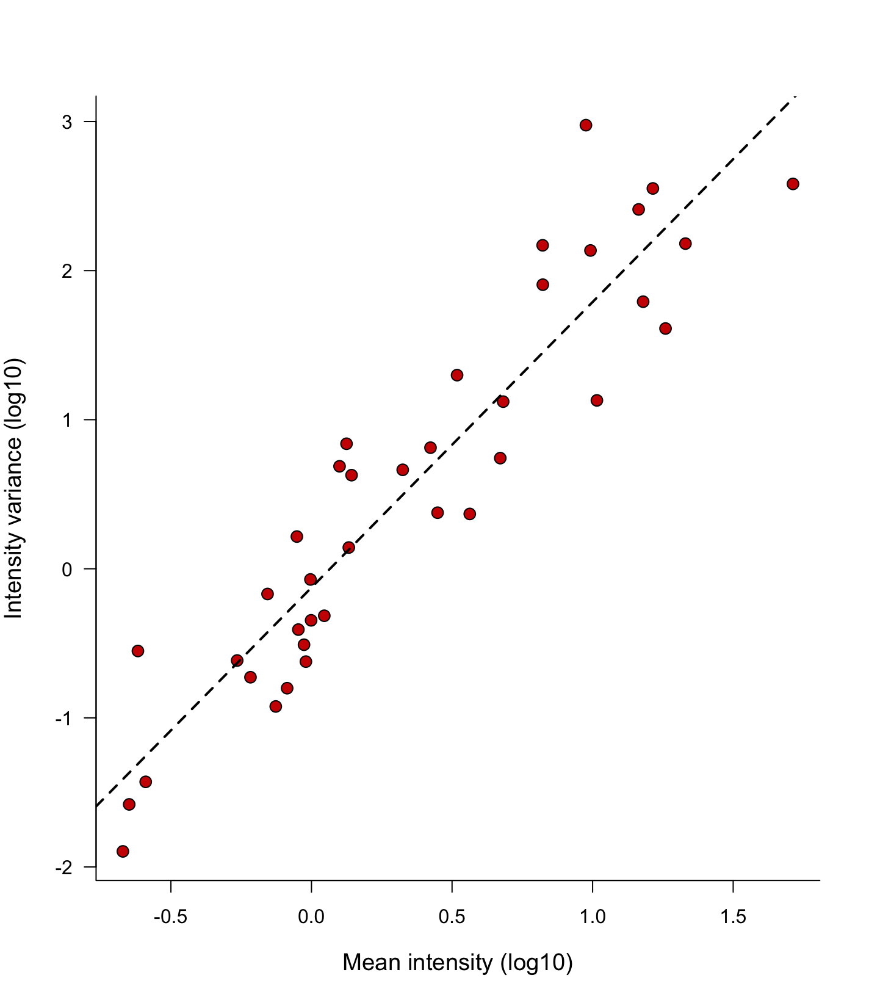
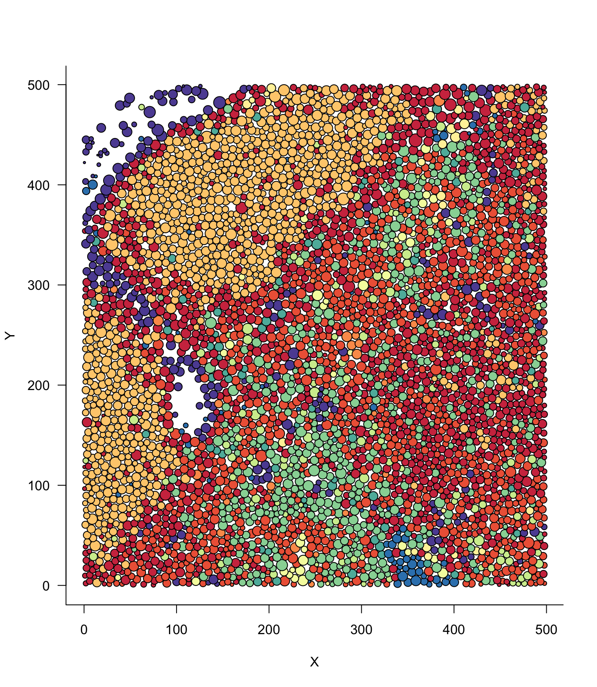
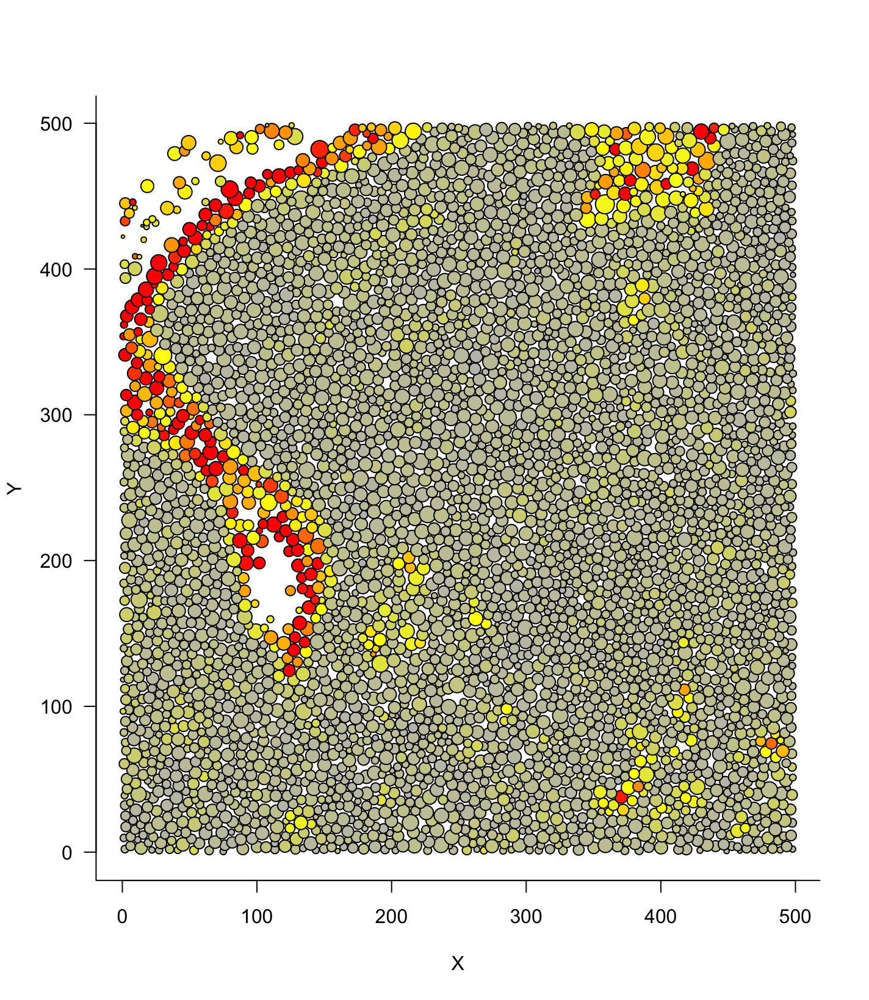
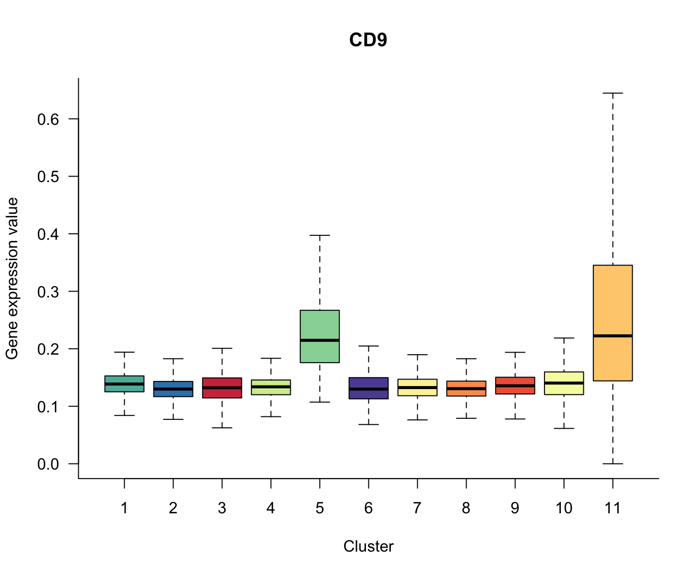
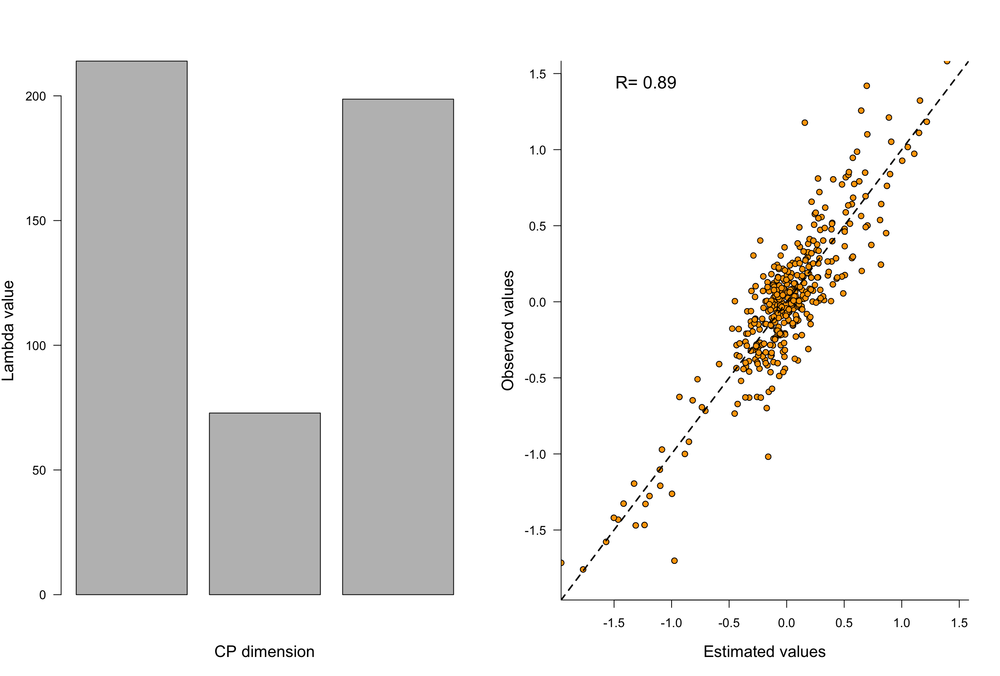
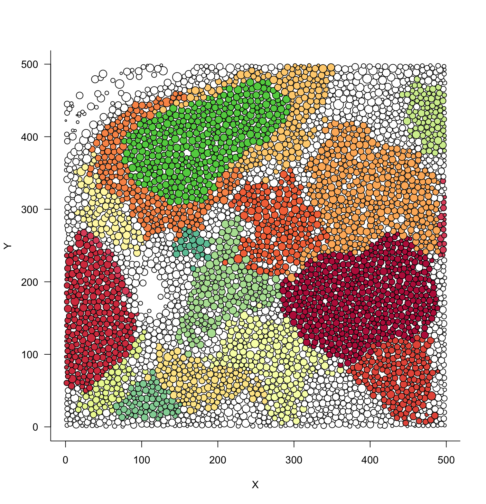

# Balagan (בלגן)

Balagan is an R-package dedicated to the study of large-scale Multiplexed Imaging (MI) datasets. It contains several tools allowing to :

- Normalize and process the original data, i.e transforming and clustering the data.
- Infer the best parameters for an optimal spatial sampling strategy.
- Vizualise the data with various plotting functions.
- Study and quantify cell-cell interactions using various interaction scores derived from the spatial point pattern theory and tensor decomposition approaches.

Balagan is based on the **SingleCellExperiment** object structure and is therefore compatible with a variety of other single-cell analysis tools.
This package is aimed to provide advanced and robust statistical tool for the analysis of MI and therefore I **strongly recommend** the user to read all the mathematical papers mentionned in the documentation.

People interested in spatial sampling can read our [biorxiv paper](https://www.biorxiv.org/content/10.1101/2021.11.28.470262v2) and can have a look at the full tutorial associated [here](https://github.com/BodenmillerGroup/Balagan/blob/main/Tutorial_sampling.md) on how to use Balagan for spatial sampling analysis.


# Installation

Balagan can be installed from the source file :

```r
install.packages(c("devtools","pheatmap","rTensor","spatgraphs","statmod"))
devtools::install_local("Path/to/balagan_0.1.tar.gz",dependencies = T)
```

It can also be installed using devtools :

```r
devtools::install_github("BodenmillerGroup/Balagan")
```


# Data loading

Data can be loaded throug different functions. The simplest manner is to load the output of the CellProfiler **(CP)** pipeline as it will be automaticall processed and annotated. This can be done by simply typing the following command :

```r
List_data = Load_IMC_data(Path_to_cell_file = "Desktop/analysis/cpout/cell.csv",
                         Path_to_panel_file ="Desktop/analysis/cpout/panel.csv")
sce = Create_SCE(List_data,dimension = "2D",Bit_mode = 16,N_core = 6)
```

The first function loads the CP output (cell.csv) together with the annotation panel file (panel.csv file) while the second functions aggregates the data into a SingleCellExperiment (sce) object. Please carefully selects the number of cores that will be used by the parallelized functions of Balagan (N_core function) !
For a full description of how those functions can be tuned to load other types of files please see their associated documentation files.

# Data normalization

Highly multiplexed intensity data can be transformed using various functions. In Balagan two types transforms are available :
+ The inverse hyperbolic sinus transform. This transformation is the standard variance stabilizing transform (VST) for many distributions, including Negative Binomial distribution. The cofactor is either provided by the user or is automatically computed by calculting the relation between the mean and the variance across channels.
+ The residual count transform. This transformation is only possible if the data provided represents the total metal/fluorescence intensity (and not the mean) and if the size (in pixel) of each cell is available in the sce object. Briefly for each channel a log-Poisson regression between the total intensity and the size of the cell is computed. The residuals are then extracted and transformed and are then considered as the new expression value. 

Each transform is implemented in a dedicated function :

```r
sce = Arcsinh_normalization(sce)
sce = Count_normalization(sce,residual_normalisation = "Pearson")
```
Each transformation will be stored in a different slot within the sce object and can be selected to perform the next analysis steps.

 

# Data clustering

So far, only a graph-based clustering method has been implemented in Balagan. A K-nearest neighbor graph is first computed before performing community detection using either the Louvain, Infomap or 'greedy' methods. The user can change the value of the K parameter, as well as the metric used to build the KNN (euclidean or cosine). Of course the user can select on which data slot the clustering is performed : the raw data ("Raw_intensity"), count transformed ("Count_normalised_intensity") and the arcsinh transform ("Arcsinh_transformed_intensity")

```r
sce = KNN_clustering(sce,K = 15,clustering_method = "Louvain",assay_type = "Count_normalised_intensity",metric = "L2")
```

The resulting clustering is stored as a column label within the sce object and can be accessed using :

```r
colLabels(sce)
```
# Visualization

To easily visualize the results of the processing/clustering steps, Balagan contains several functions including **Plot_cluster_spatial()** and **Plot_gene_expression_spatial()**.

Both functions plot the cell location and colored the cells based on their cluster or the expression level of a specific gene. The user can select which field of view/image he wants using the 'Image_number' parameter, as well as the size of the points with the 'Cex_parameter' option

```r
Plot_cluster_spatial(sce,Image_number = 3,Cex_parameter = 6)
```
 


```r
Plot_gene_expression_spatial(sce,Cex_parameter = 6,assay_type = "Raw_intensity",Gene = "CD9",Image_number = 3)
```

 

Of course the expression level of an individual gene across clusters can also be visualized :

```r
Plot_cluster_gene_expression(sce,Gene = "CD9",assay_type = "Count_normalised_intensity" )
```

 

Worth noting, the boxplot colours correspond exactly to the color used by the **Plot_cluster_spatial()** function, allowing to easily compare the plots.

  
# Interaction tensors 

Balagan is able to describe the spatial structure of a group of images using a mathematical object called a tensor. For a good introduction to tensors and tensor factorisation I would recommend the excellent review "Tensor Decompositions and Applications" by Kolda and Bader.

First interactions between every pair of cell types in every pictures are computed : it can be done using the **Clak-Evan** (CE) or the **Dixon** aggregation index (this step can be quite time-consuming if too many pictures have been taken) : 
```r
Dixon_tensor = Dixon_interaction_tensor(sce)
CE_tensor = CE_interaction_tensor(sce)
```

The obtained tensors are complex to handle and interpret. We must therefore perform a dimensionality reduction step called **Canonical Polyadic** (CP) decomposition. Like classical dimensionality reduction techniques such as PCA or NMF, the number of dimension has to be provided, as well as other aspects such as centering and scaling of the data :   
```r
CP_decomposition = Compute_CP_decomposition(CE_tensor,num_components = 3,Center_data = T,Scale_data = F)
```
At the end of the computation, a diagnostic plot should be produced to check the quality of the model. Do not hesitate to change the number of component to find the optimal decomposition : indeed, unlike for matrix factorization, a CP reduction with k-1 component is not comprised within a CP reduction with k components. I recommend every user to read a bit about CP before using this feature !

 


# Patch detection

A different approach to calculating interaction tensors consists in the detection of cell patches, i.e physically contiguous group of cells with a spatially homogenous cell composition. Briefly, for each selected image, a graph is computed (can be a KNN, fixed radius, Gabriel's or Delaunay's graph) and a weight is computed between each neighbor based on the cell type composition of their respective neighborhood (can be first but also second, third... order neighbors). Communities are then detected using either a greedy clustering or an in-house approach ('saturation' approach).

This appraoch is extremely parameter sensitive and should be used with care due to the large computational cost currently required to perform such analysis : 

```r
Patch_list = Patch_detection(sce,graph_type = "Radius",graph_parameter = 30,neighbor_degree = 1,clustering_method = "saturation",distance_composition = "Bray-Curtis",image_list = 3)
```

The result of the analysis can easily be visualized :

```r
Plot_cluster_spatial(sce,Image_number = 3,Cex_parameter = 6,Provided_cluster = Patch_list[[1]])
```
 

It is worth noting that when the selected clustering method is 'saturation', not all cells will be assigned to a patch : those cells will receive the label '0' meaning that they do not belong to an 'intersting zone' and are therefore removed from analysis.


