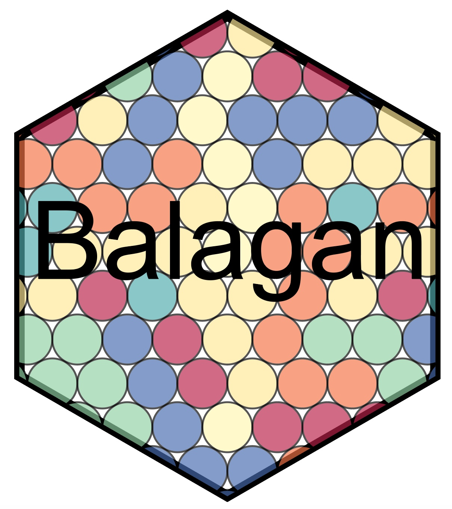

             

Balagan is an R-package dedicated to the statistical analysis of Multiplexed Imaging (MI) datasets. It contains several tools allowing to :

- Normalize and process the original data, i.e transforming and clustering the data.
- Infer the best parameters for an optimal spatial sampling strategy.
- Perform statistically powerful differential abundance analysis.
- Simulate stratified sampling using large multiplexed imaging panorama.


Balagan is based on the **SingleCellExperiment** object structure and is therefore compatible with a variety of other single-cell analysis tools.
This package is aimed to provide advanced and robust statistical tool for the analysis of MI and therefore I **strongly recommend** the user to read all the mathematical papers mentionned in the documentation.

Scripts initially written for our [Nature Method paper](https://www.nature.com/articles/s41592-022-01692-z) have been integrated to this package.

# Installation

Balagan can be installed from the source file :

```r
devtools::install_local("Path/to/balagan_1.0.0.tar.gz",dependencies = T)
```

It can also be installed using devtools :

```r
devtools::install_github("PierreBSC/Balagan")
```
# Recommended reading list

Before performing any analysis using Balagan, we strongly recommend you to be familiar with some key statistical concepts. Below is a list of papers, notes and book chapters that  :
- Our [paper](https://www.nature.com/articles/s41592-022-01692-z) on random sampling.
- Our new [biorxiv preprint]() on the statistical modeling of cell count data obtained by multiplexed imaging.
- The [mathematical notes](https://github.com/PierreBSC/Balagan/blob/main/Multiplexed_imaging_statistics.pdf) associated with our new preprint.
- For an introduction to Generalized Linear Models, chapter 4 of ["An Introduction to Statistical Learning"](https://www.statlearning.com).
- The excellent textbook on spatial point pattern ["Statistical analysis and modelling of spatial point patterns"](https://scholar.google.com/scholar_lookup?&title=Statistial%20analysis%20and%20modelling%20of%20spatial%20point%20patterns&publication_year=2008&author=Ilian%2CJ&author=Penttinen%2CA&author=Stoyan%2CH&author=Stoyan%2CD). While reading the 557 pages of this book is not necesseray, key notions (comlplete spatial randomness, homogenous poisson point pattern...) are explained in a simple yet rigorous manner in this book

# List of tutorials

As mentionned above, Balagan can be used to perform various tasks and comprehensive tutorials have been written for each of them:
- [ MI data processing](https://github.com/PierreBSC/Balagan/blob/main/Tutorial_data_processing.md)
- [Basic spatial sampling analysis](https://github.com/PierreBSC/Balagan/blob/main/Tutorial_sampling.md) and the corresponding guide for [Visium data processing](https://github.com/PierreBSC/Balagan/blob/main/Processing_Visium_data.md)
- [Differential abundance analysis](https://github.com/PierreBSC/Balagan/blob/main/Tutorial_DA_analysis.md)
- [Hierarchical differential analysis](https://github.com/PierreBSC/Balagan/blob/main/Tutorial_hierarchical_analysis.md)
- [Stratified spatial sampling tutorial](https://github.com/PierreBSC/Balagan/blob/main/Tutorial_stratified_sampling.md)


