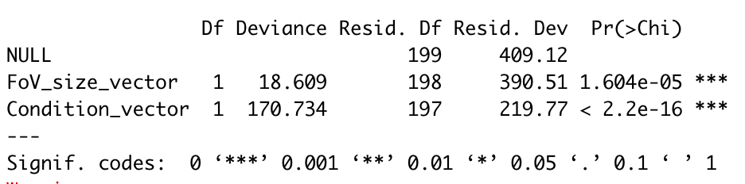
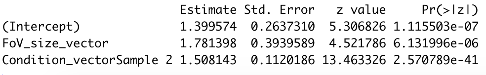
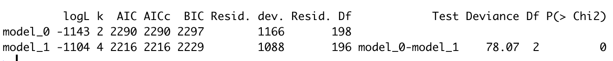
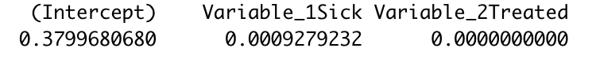

# Differential Abundance (DA) analysis of cell count data 

The final stage of multiplexed imaging data analysis usually consists in the comparison of specific cell type abundance between groups of samples. To do so, one can use Negative-Binomial (NB) or Beta-Binomial (BB) based regressions to detect difference of abundances. Balagan implements basic differential tests but for more complicated cases, the original functions contained in the packages [aod](https://cran.r-project.org/web/packages/aod/) and [MASS](https://cran.r-project.org/web/packages/MASS/) should be used.

## Basic differential abundance test using NB test

We start by a very simple usecase where two groups of observations have been sampled. In the case of multiplexed imaging, this will corresponds to Fields of View (FoVs) coming from two biological samples. We assume that all FoVs have the same size.

We start by loading the balagan library and by creating simulated data :

```r
library(balagan)
Sample_1 = rnbinom(n = 100,mu = 10,size = 2)
Sample_2 = rnbinom(n = 100,mu = 20,size = 2)
Count_vector = c(Sample_1,Sample_2)
Condition_vector = c(rep("Sample 1",100),rep("Sample 2",100))
```
We can now perform the DA analysis based on a NB distribution with **Likelihood Ratio Test** (LRT) or a **Wald's test**:

```r
NB_DA_test(Count_vector,Condition_vector,type_test = "LRT")
NB_DA_test(Count_vector,Condition_vector,type_test = "Wald")
```

When only two groups of samples are compared, LRT and Wald's test will usually display similar results. However when more than two groups of samples are studied, and that the statistical significance of more than one term can be tested, the two tests differ :

- The LRT compares the full model to the null model, similarly to an ANOVA, and the significance of each term (i.e the effect of each group) is not tested. Thus only one p-value is provided.
- The Wald's test identifies terms that are significantly different from zero, thus if N groups of samples are compared, N-1 p-values will be computed.


## Basic differential abundance test using BB test

DA analysis based on the BB distribution can be performed similarly to NB test, the only difference being that we do not need to assume similar FoV size and that we have to provide the total number of cells present in the FoV. Again we simulate two groups of sample :

```r
P_sample_1 = rbeta(n = 100,shape1 = 2,shape2 = 20)
P_sample_2 = rbeta(n = 100,shape1 = 6,shape2 = 10)

Total_cell_number = 400
Sample_1 = rbinom(n = 100,size = Total_cell_number,prob =P_sample_1 )
Sample_2 = rbinom(n = 100,size = Total_cell_number,prob =P_sample_2 )

Count_vector = c(Sample_1,Sample_2)
Condition_vector = c(rep("Sample 1",100),rep("Sample 2",100))
```

Then, a BB based test can be performed, either using a LRT or Wald's test :

```r
BB_DA_test(Count_vector,Total_cell_number,Condition_vector,type_test = "LRT")
BB_DA_test(Count_vector,Total_cell_number,Condition_vector,type_test = "Wald")
```

## Advanced differential abundance test

While the build-in balagan functions can be applied easily, they only work for very simple experimental design : one categorical factor with multiple groups. If one wants to include continuous covariate or multiple categorical factors, then native functions from the packages [aod](https://cran.r-project.org/web/packages/aod/) and [MASS](https://cran.r-project.org/web/packages/MASS/) have to be used. We strongly advise the user to familiarize themselve with the **Generalized Linear Model** (GLM) mathematical and R framework. A very nice introduction can be found in the excellent book ["An Introduction to Statistical Learning"](https://www.statlearning.com) (Chapter 4).

### NB based approach
Analysis of experiments with complex design based on NB distribution can be performed through the **glm.nb()** function from the **MASS** package.
Here we will simulate cell count data coming from FoVs of variable size 

```r
library(MASS)
FoV_size_1 = (rnorm(n = 100,mean = 0.8,sd = 0.1))^2
FoV_size_2 = (rnorm(n = 100,mean = 0.8,sd = 0.1))^2

Sample_1 = rnbinom(n = 100,mu = FoV_size_1*20,size = 2)
Sample_2 = rnbinom(n = 100,mu = FoV_size_2*100,size = 2)

Count_vector = c(Sample_1,Sample_2)
FoV_size_vector = c(FoV_size_1,FoV_size_2)
Condition_vector = c(rep("Sample 1",100),rep("Sample 2",100))
```

We can now fit the NB GLM :

```r
NB_model = glm.nb(Count_vector~FoV_size_vector+Condition_vector)
```
The significance of each variable can be assessed easily through a LRT :

```r
LRT_NB_model = anova(NB_model)
print(LRT_NB_model)
```
  

The last column corresponding to the p-value obtained by LRT. Of course, a Wald's test can also be performed :

```r
Wald_NB_model = coef(summary(NB_model))
print(Wald_NB_model)
```

  

It is worth noting that the glm.nb() function assumes that over-dispersion is constant across samples and does not vary across groups. While some simulations have shown that limited changes of the NB overdispersion parameter does not affect the statistical power of such analysis (cf this [excellent paper](www.ncbi.nlm.nih.gov/pmc/articles/PMC2631439/)), this is certainly the biggest flaw of this approach.

### BB based approach

The BB regression are a more complex to implement than the NB, but are more statistically powerful, especially for the analysis of spatially aggregated cell types. We will use the **betabin()** function from the **aod** package.
Again we simulate data, with two categorial variables :

```r
library(aod)
P_sample = rbeta(n = 200,shape1 = rep(c(1,2),each=100) + rep(c(0,4),100) ,shape2 = 1)
Count_vector = rbinom(n = 200,size = Total_cell_number,prob =P_sample )
Condition_vector_1 = rep(c("Healthy","Sick"),each=100)
Condition_vector_2 = rep(c("Control","Treated"),100)
Total_cell_number = 400
```
We first build a data.frame object :

```r
data_BB = data.frame(n = Total_cell_number, 
                     y = Count_vector, 
                     Variable_1 = Condition_vector_1,
                     Variable_2 = Condition_vector_2)
```
We then fit two models : one full (**model_1** object) and one with only an intercept (**model_0** object). Here we assume that overdispersion is constant across samples (random = ~1) :

```r
model_1 = betabin(cbind(y, n - y) ~ ., data = data_BB, random = ~1)
model_0 = betabin(cbind(y, n - y) ~ 1, data = data_BB, random = ~1)
```
We then compare both models by performing a LRT:

```r
LRT_test_BB = anova(model_0, model_1)
print(LRT_test_BB)
```
  

A Wald's test can also be performed but due to the lack of a dedicated function, it requires a bit more code :

```r
Pvalue_test = c()
for (k in 1:length(coef(model_1))) {
  Wald_test_BB = wald.test(b = coef(model_1), Sigma = vcov(model_1, 
                                                           comlete = F), Terms = k)
  Pvalue_test = c(Pvalue_test, Wald_test_BB$result$chi2[3])
}
names(Pvalue_test) = names(coef(model_1))
print(Pvalue_test)
```

  

Lastly, as mentionned earlier, the **betabin()** function allows for a variable overdispersion parameter. However only one categorical variable can be used to model overdispersion variation ! 

```r
model_1 = betabin(cbind(y, n - y) ~ ., data = data_BB, random = ~ Variable_1)
model_0 = betabin(cbind(y, n - y) ~ 1, data = data_BB, random = ~ Variable_1)
```


## Mixed model for clinical cohort analysis (to be released soon...)


