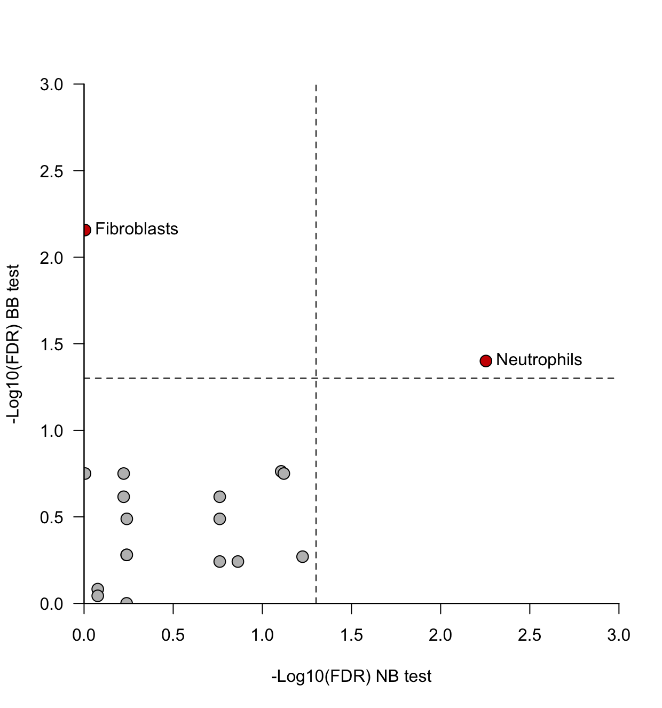

#Analysis real-world data using hierarchical models

Usually, multiplexed imaging data have a hierarchical structures :

1. For each biological sample, multiple Fields of Views (FoVs) are imaged.  
2. Samples can be aggregated into biologically meaninful groups, for instance healthy donors and patients.

What we are interested in is a difference of cell 

First we need to load two R libraries: 

1. [Zellkonverter](https://github.com/theislab/zellkonverter) to load h5af files
2. [glmmTMB](https://cran.r-project.org/web/packages/glmmTMB/index.html) to fit hiearchical mixed NB and BB models 

```r
library(zellkonverter)
library(glmmTMB)
```

The data we will use are derived from [Rendeiro et al.](https://www.nature.com/articles/s41586-021-03475-6) and were downloaded from [Zenodo](https://zenodo.org/records/4139443). We first load the h5af file using the zellkonverter package :

```r
sce = readH5AD("Desktop/Revision_Stat_paper/Hierarchical_model_revision/covid-imc.h5ad")
``` 

We then create a contingency table and a data frame containing the variables associated to each FoV (sample of origin, disease status etc..) :

```r
Cell_count_ROI = table(sce$roi,sce$metacluster_label)
Condition_vector = unique(data.frame(ROI = sce$roi, Patient = sce$sample, Disease = sce$disease,Disease_refined = sce$phenotypes))
```

In addition we compute the mean cell density and proportion as well as the total number of cells in each FoV:

```r
Mean_abundance = colMeans(Cell_count_ROI)
Mean_proportion= colMeans(Cell_count_ROI/rowSums(Cell_count_ROI))
ROI_total_cells = rowSums(Cell_count_ROI)
```

### Negative Binomial (NB) hierarchical model

We start the analysis by fitting a NB model and testing the significance of the disease status (this can take a few seconds):

```r
NB_p_value_mixed = c()
Matrix_p_value_NB_mixed = c()

for (k in 1:ncol(Cell_count_ROI)) {
  y_pos = Cell_count_ROI[,k]
  U = data.frame(y_pos,Patient = Condition_vector$Patient,Disease = Condition_vector$Disease)
  NB_1 <- glmmTMB(y_pos~ 1 +  Disease + (1|Patient),
                  family=list(family="nbinom2",link="log"),
                  data=U)
  NB_0 <- glmmTMB(y_pos~ 1  + (1|Patient),
                  family=list(family="nbinom2",link="log"),
                  data=U)
  anova_temp = anova(NB_1,NB_0)
  NB_p_value_mixed= c(NB_p_value_mixed,anova_temp$`Pr(>Chisq)`[2])
  u = summary(NB_1)
  Matrix_p_value_NB_mixed = rbind(Matrix_p_value_NB_mixed,u$coefficients$cond[-1,4])
}

```

Basically we fit two models: the full model NB\_1 and the null model NB\_0. NB\_0 is nested within NB\_1, we can thus perform a likelihood ratio test through the anova() function. The resulting p-values are stored in the NB\_p\_value\_mixed vector. It is worth noting that such analysis is similar to a regular ANOVA: even though we observe multiple groups, only one p-value is returned as we only test the significance of the variable 'disease'.

If one wants to know the contribution of each disease group to the cell abundance, a Wald's test has to be performed for each coefficient. In the code this is done by using the summary() function and extracting the resulting coefficients (we remove the first row corresponding to the intercept term). The obtained p-values are stored in the matrix Matrix\_p\_value\_NB\_mixed where each row corresponds to a cell type and each column to disease group (COVID-19, influenza etc..)

Of course multiple testing correction has to be performed, for example for the NB\_p\_value\_mixed vector we can apply the Benjamini Hochberg correction:

```r
NB_fdr_mixed = p.adjust(NB_p_value_mixed,method='BH')
names(NB_fdr_mixed) = names(Mean_abundance) # We add the cell type name for better interpretation
```


### Beta Binomial (BB) hierarchical model

We can perform similat tests but with a beta-binomial model. It is worth noting that we will not exactly model the same variable:

1. The BB distribution models cell type proportion: what is the fraction of cells belonging to a given type
2. The NB distribution models the cell density: how many cells of a given cell type can we find per unit of surface.

Thus the results of the two tests might not be identical.


```r
BB_p_value_mixed = c()
Matrix_p_value_BB_mixed = c()

for (k in 1:ncol(Cell_count_ROI)) {
  y_pos = Cell_count_ROI[,k]
  y_neg = ROI_total_cells-Cell_count_ROI[,k]
  U = data.frame(y_pos,y_neg,Patient = Condition_vector$Patient,Disease = Condition_vector$Disease)
  BB_1 <- glmmTMB(cbind(y_pos,y_neg)~ 1 +  Disease + (1|Patient),
                        family=list(family="betabinomial",link="logit"),
                        data=U)
  BB_0 <- glmmTMB(cbind(y_pos,y_neg)~ 1  + (1|Patient),
                      family=list(family="betabinomial",link="logit"),
                      data=U)
  
  anova_temp = anova(BB_1,BB_0)
  BB_p_value_mixed= c(BB_p_value_mixed,anova_temp$`Pr(>Chisq)`[2])
  u = summary(BB_1)
  Matrix_p_value_BB_mixed = rbind(Matrix_p_value_BB_mixed,u$coefficients$cond[-1,4])
}
```
Again we perform both likelihood ratio tests and Wald's test and obtain a p-value vector and matrix.

```r
BB_p_value_mixed_corrected = p.adjust(BB_p_value_mixed,method = "fdr")
names(BB_p_value_mixed_corrected) = names(Mean_abundance) 
```
We can now compare the results of the NB and BB analysis:

```r
par(las=1,bty='l')
plot(-log10(NB_p_value_mixed_corrected),-log10(BB_p_value_mixed_corrected),
     xlim=c(0,3),ylim=c(0,3),xlab="-Log10(FDR) NB test",ylab="-Log10(FDR) BB test",xaxs='i',yaxs='i',cex=1.5,
     pch=21,bg=string.to.colors(NB_p_value_mixed_corrected<0.05 | BB_p_value_mixed_corrected<0.05,colors = c("grey","red3")))
abline(v=-log10(0.05),lty=2,col="black")
abline(h=-log10(0.05),lty=2,col="black")
text(-log10(NB_p_value_mixed_corrected[NB_p_value_mixed_corrected<0.05 | BB_p_value_mixed_corrected<0.05]),
     -log10(BB_p_value_mixed_corrected[NB_p_value_mixed_corrected<0.05 | BB_p_value_mixed_corrected<0.05]),
     labels = names(Mean_abundance)[NB_p_value_mixed_corrected<0.05 | BB_p_value_mixed_corrected<0.05],pos = 4)
```


 

