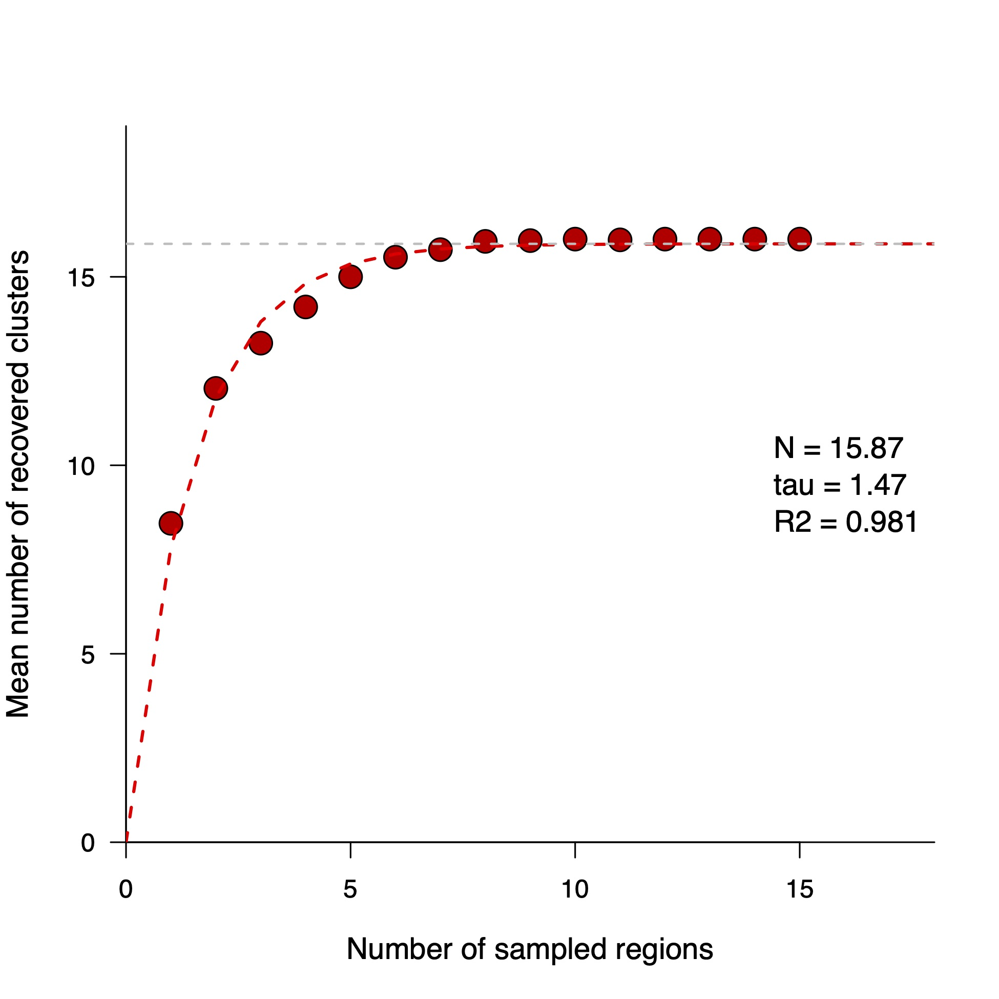
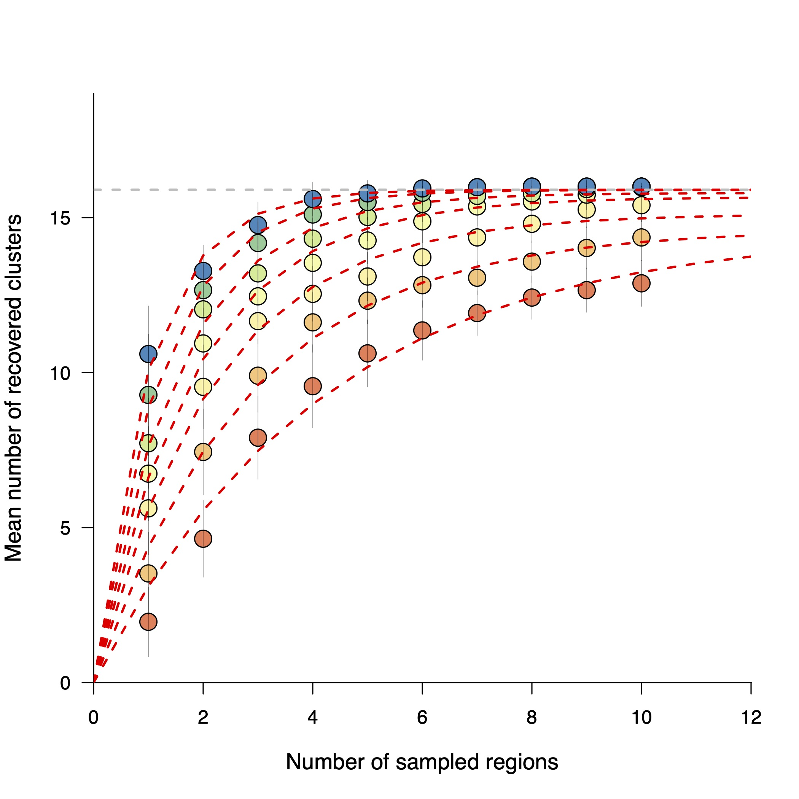
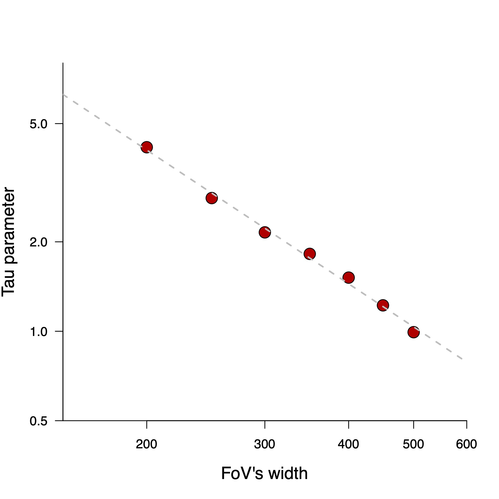
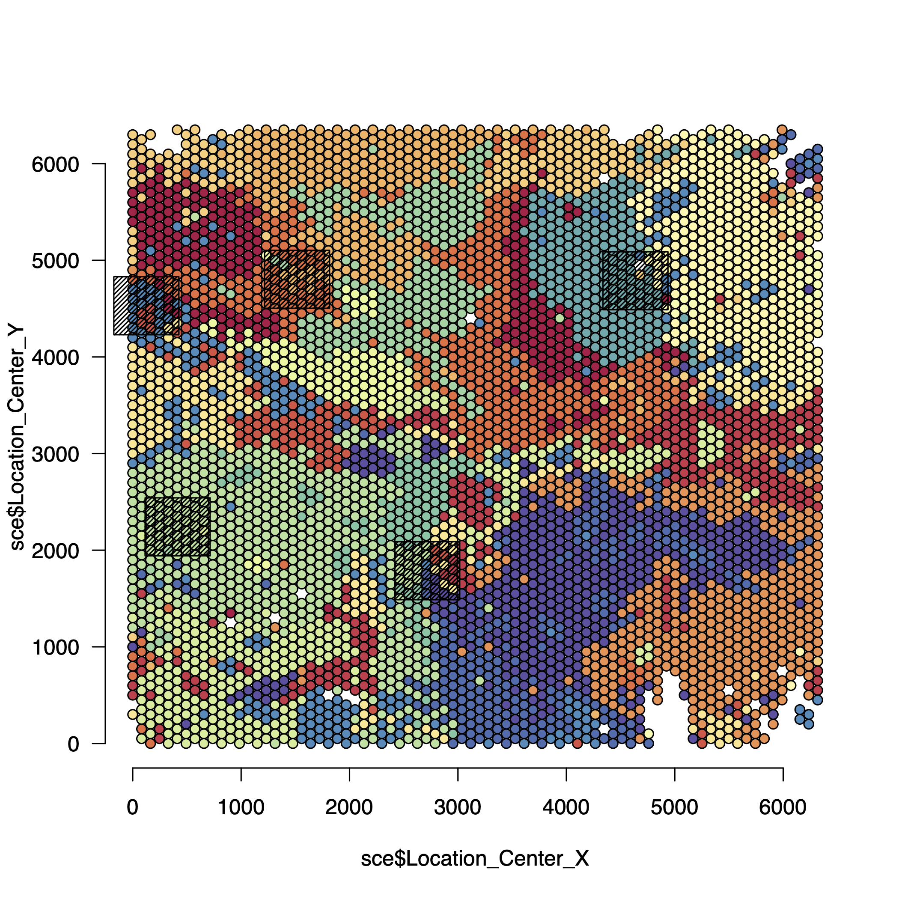
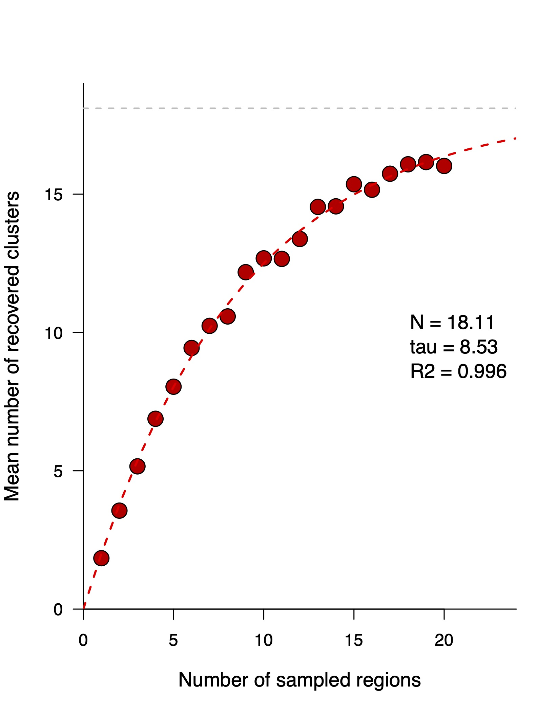
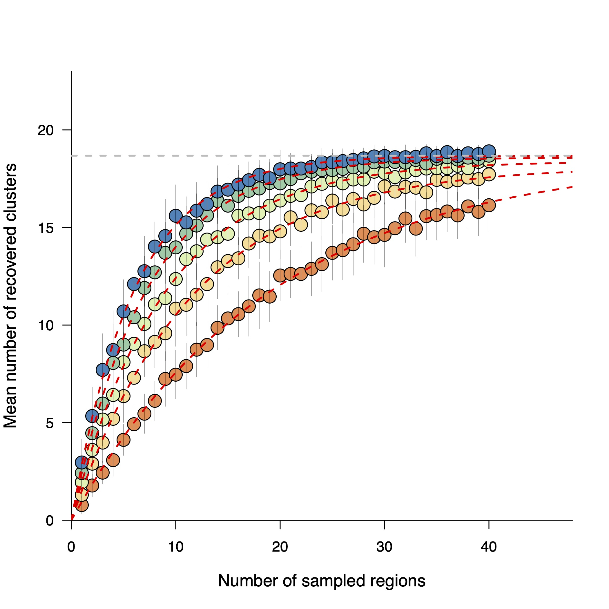
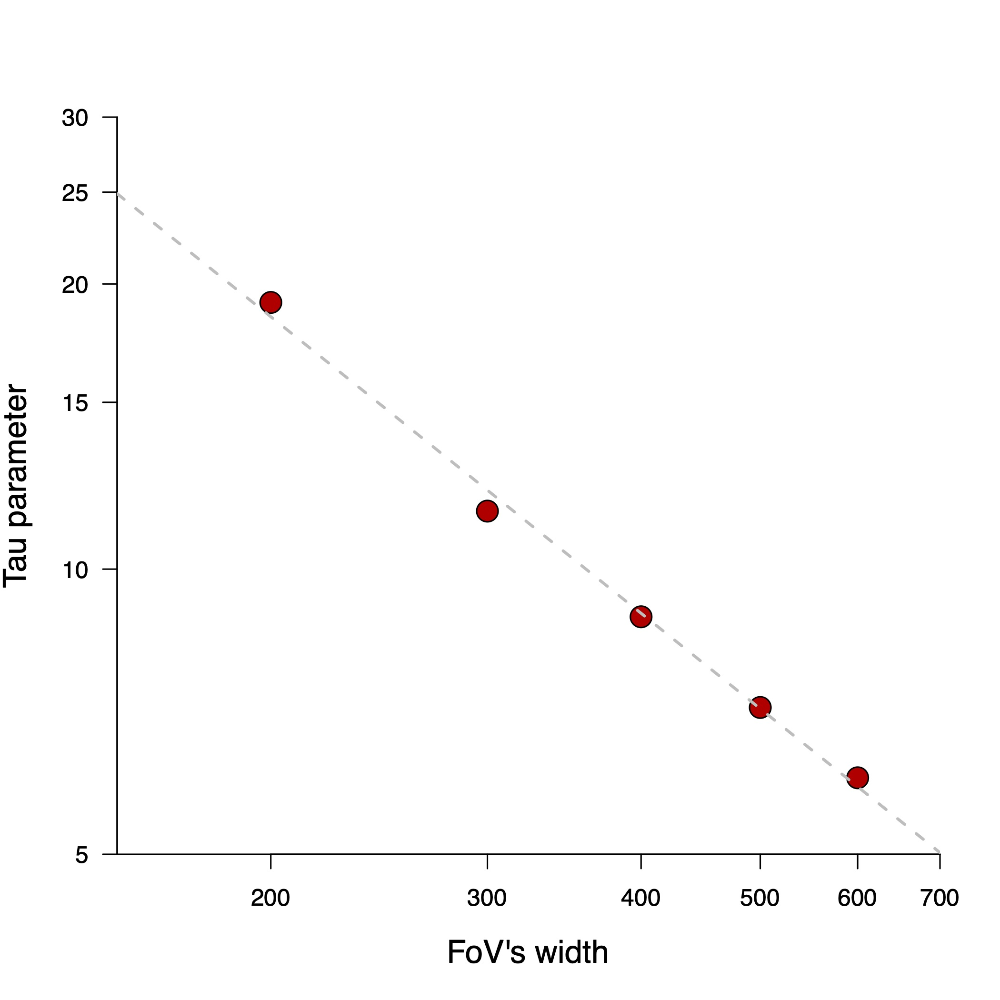

# Spatial sampling analysis 

Balagan contains various functions to study the optimal spatial sampling strategy to characterize a given tissue using Multiplexed Imaging (MI). This can be done either using a large and representative Field of View (several mm2) generated using MI or using Spatial Transcriptomic (ST) data. Alternatively, one can use a large number of small FoVs to estimate some parameters.

## Using a large MI FoV

We assume that the data have been processed using Balagan basic functions and are now stored in a SingleCellExperiment object.

We start by performing a simple sampling simulation :

```r
Random_spatial_sampling(sce,width_FOV = 500,height_FOV = 500,N_samplings = 10)
```
 

If the resulting plots seems correct (check the dimension of the sampling FoV), you can now launch a real analysis :

```r
Simple_sampling_analysis = Perform_sampling_analysis(sce,Selected_image = 1,N_times = 50,N_sampling_region_vector = 1:20,width_FOV_vector = 400,height_FOV_vector = 400,Threshold_detection = 2)
```


This command will simulate samplings with a various number of sampled FoVs (from 1 to 20) but with a constant size. A cell type/cluster was considered as being detected if more than 50 cells of this cluster was detected and each different sampling was repeated 50 times (N_times parameter). Of course, the parameter values need to be adapted to the data : if the N sampling region_vector parameter is too high, this may significantly slow down or even block the script... 

The result of the analysis can easily be plotted and an exponential function derived from Point Pattern theory fitted to the data (see biorxiv paper) : 

```r
Visualize_simple_sampling(Simple_sampling_analysis)
```
 


We can now try to extract the 𝛂 parameter. To do so we have to compute the tau parameter for different size of FoVs. Here we perform sampling with FoV of size ranging from 200µm to 600µm : 

```r
height_vector = rep(c(200,250,300,350,400,450,500),each=10)
width_vector = rep(c(200,250,300,350,400,450,500),each=10)
N_sampling_region_vector = rep((1:10),7)

Complex_sampling = Perform_sampling_analysis(sce,Selected_image = 1,N_times = 50,
                                             N_sampling_region_vector = N_sampling_region_vector,
                                             width_FOV_vector = width_vector,
                                             height_FOV_vector = height_vector,
                                             Threshold_detection = 50)

```
Once the simulated samplings are done we can extract the different values taken by tau :

```r
Parameter_table = data.frame(Height =height_vector,
                             Width =width_vector)

Fitting_tau = Visualize_complex_sampling(Complex_sampling,Parameter_table)
```

 


Last but not least we can plot and estimate the relation between tau and the FoV width :

```r
FoV_width = c(200,250,300,350,400,450,500)
plot(FoV_width,Fitting_tau[,"tau"],log="xy",xlim=c(150,700),ylim=c(5,30),
     xaxs='i',yaxs='i',xlab="FoV's width",ylab="Tau parameter",cex.lab=1.3,pch=21,bg="red3",cex=2)
m = lm(log10(Fitting_tau[,"tau"])~log10(FoV_width))
abline(coef(m),lwd=2,lty=2,col="grey")
print(coef(m))
```

 

The slope coefficient of the linear model corresponds to the alpha coefficient while the intercept is the technology/panel dependant parameter termed **C** in the manuscript !


## Using a Spatial Transcriptomic (Visium®) dataset

Like for MI data, ST data need to be first processed and then stored in a SingleCellExperiment before analysis. The data used here were generated using Visium® technology applied on a human lymph node and is freely accessible [here](https://www.10xgenomics.com/resources/datasets/human-lymph-node-1-standard-1-1-0).

The data were processed using the [Pagoda2](https://github.com/kharchenkolab/pagoda2) and the [CountClust](https://bioconductor.org/packages/release/bioc/html/CountClust.html) R packages : briefly the 1500 most variable genes were extracted and a Latent Dirichlet Allocation analysis was performed to reduce the dimensionality of the data before clustering the cells using a graph-based approach. 

image lymph node avec points colorés par cluster 

We start by creating the SCE object :

```r
sce = SingleCellExperiment(assays = list(Raw_intensity = as.matrix(t(Mixing))), #Mixing : matrix resulting from the LDA analysis
                           metadata = list(dimension = "2D", 
                                           N_core = 8, Is_nuc_cyt = F))
colLabels(sce) = as.numeric(r$clusters$LDA$LDA_cluster) # We assign a cluster to each RNA capture spot
sce$Location_Center_X = Location_count$Location_X  # We assign a cluster to each RNA capture spot
sce$Location_Center_Y = Location_count$Location_Y
sce$ImageNumber =  1
```

**Warning** : be carreful about the unit of the X/Y spatial location, especially when you want to compare MI and ST data... In the case of Visium data we used the following code to the get the position at a µm scale : 

```r
data_location = read.delim("Desktop/TLO_analysis/Glioblastoma/spatial/tissue_positions_list.csv",sep=",",header = F,row.names = 1)
data_location = data_location[colnames(data_raw),]
data_location = data_location[,c(2,3)]
colnames(data_location) = c("Location_X","Location_Y")
data_location$Location_X = data_location$Location_X*6400/78
data_location$Location_Y = data_location$Location_Y*6400/128
```

We can now perform a simple simulation of sampling. If for instance we want to sample 10 square FoVs of a width/height of 400µm :

```r
Random_spatial_sampling(sce,width_FOV = 400,height_FOV = 400,N_samplings = 10)
```

 

If the code works, a real analysis can now be performed :

```r
Simple_sampling_analysis = Perform_sampling_analysis(sce,Selected_image = 1,N_times = 50,N_sampling_region_vector = 1:30,
                                                     width_FOV_vector = 400,height_FOV_vector = 400,Threshold_detection = 2)

```
This command will simulate samplings with a various number of sampled FoVs (from 1 to 30) but with a constant size. A cell type/cluster was considered as being detected if more than 2 spots of this cluster was detected and each different sampling was repeated 50 times (N_times parameter). The detection threshold is significantly changed compared to the previous IMC dataset as we are no longer working single-cell but rather with RNA-capture spots that represent up to several dozens of cells each.

The result of the analysis can easily be plotted and the fitting of the exponential function extracted: 

```r
Visualize_simple_sampling(Simple_sampling_analysis)
```

 


We can now try to extract the 𝛂 parameter. To do so we have to compute the tau parameter for different size of FoVs. Here we perform sampling with FoV of size ranging from 200µm to 600µm : 

```r

height_vector = rep(c(200,300,400,500,600),each=30)
width_vector = rep(c(200,300,400,500,600),each=30)
N_sampling_region_vector = rep((1:30),5)

Complex_sampling = Perform_sampling_analysis(sce,Selected_image = 1,N_times = 50,
                                             N_sampling_region_vector = N_sampling_region_vector,
                                             width_FOV_vector = width_vector,
                                             height_FOV_vector = height_vector,
                                             Threshold_detection = 2)

```
Once the simulated samplings are done we can extract the different values taken by tau :

```r
Parameter_table = data.frame(Height =height_vector,
                             Width =width_vector)

Fitting_tau = Visualize_complex_sampling(Complex_sampling,Parameter_table)
```

 

Last but not least we can plot and estimate the relation between tau and the FoV width :

```r
FoV_width = c(200,300,400,500,600)
plot(FoV_width,Fitting_tau[,"tau"],log="xy",xlim=c(150,700),ylim=c(5,30),
     xaxs='i',yaxs='i',xlab="FoV's width",ylab="Tau parameter",cex.lab=1.3,pch=21,bg="red3",cex=2)
m = lm(log10(Fitting_tau[,"tau"])~log10(FoV_width))
abline(coef(m),lwd=2,lty=2,col="grey")
print(coef(m))
```
 


The slope coefficient of the linear model corresponds to the 𝛂 coefficient while the intercept is the technology/panel dependant parameter termed **C** in the manuscript !


## Using a large number of small FoVs

To conclude this tutorial, we will see how to estimate the 𝛂 parameter using a large number of small FoV. Here we will use the data from [Jackson et al.](https://www.nature.com/articles/s41586-019-1876-x), consisting in 100 FoVs acquired from Breast Cancer samples using Imaging Mass Cytometry.


We start by loading the data and reshaping the SCE object :

```r
sce = readRDS("Desktop/Post_experiment_sampling/Data_Jackson//sce.rds")
Cluster_temp =sce$metacluster
Cluster_temp[Cluster_temp>=14]=14 #Cluster > 14 : cancer cell clusters. Aggregated as they are highly patient specific 
colLabels(sce) = Cluster_temp
```
We can then estimate the 𝛂 parameter for each FoV individually : 

```r
Alpha_estimate = Global_alpha_estimation(sce)
```

We can filter the low-quality estimate, i.e estimates with an R-squared lower than 0.9 and then finally compute the mean estimation :


```r
mean(Alpha_estimate$Alpha[Alpha_estimate$R_squared>0.9])
```
In our case we found an estimated alpha of 1.02, very close to the estimate done using Visium data.
