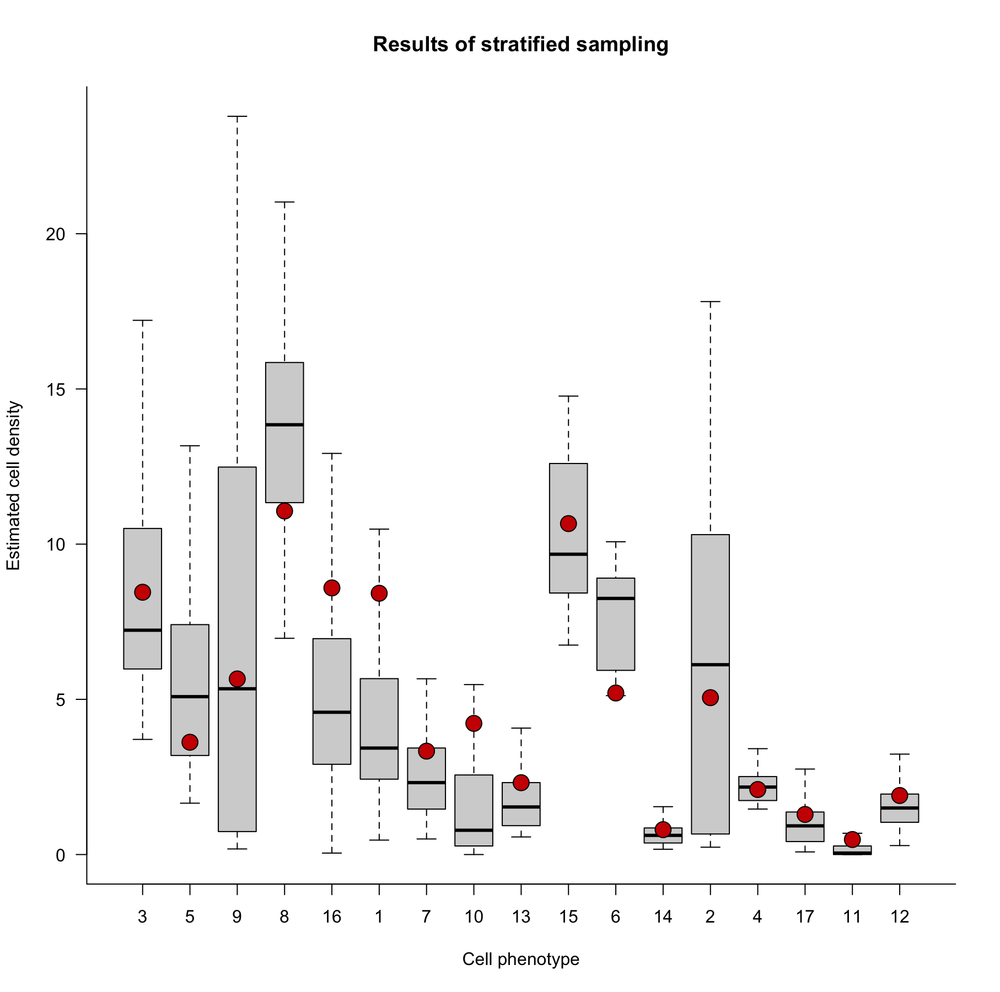

# Stratified spatial sampling analysis

This tutorial describes how to perform a simulated stratified spatial sampling on a piece of tissue. I strongly recommend the users to familiarize themselves with the stratified sampling approach by reading the excellent book by Cochran "Sampling Techniques, Third edition". 

To perform a stratified sampling, two elements will be needed :
- A SingleCellExperiment object, obtained by using our package balagan to process MI data.
- A .tiff file, corresponding to the intensity of a marker over the whole piece of tissue.  


## Loading and processing of the data

We start by loading the required packages :

```r
library(balagan)
library(tiff)
library(imager)

```

We will use in this example a sample of lymph node imaged by Imaging Mass Cytometry from our previous publication (Bost et al. 2022) https://doi.org/10.1038/s41592-022-01692-z

We will first load the tiff file (here the intensity of the CD20 B cell) :

```r
raw_Image = readTIFF("./data/Smoothed_image_CD20.tiff")
raw_Image = as.cimg(raw_Image)
raw_Image= imrotate(raw_Image,angle = -90)
plot(raw_Image)
```

Finally the single-cell object is loaded and the X/Y location data are re-organised to fit the one from the tiff file :

```r
sce=readRDS("./data/Panorama_LN_sce_object.rds")
#Inverting X/Y axis..
X = sce$Location_Center_Y
Y = sce$Location_Center_X
sce$Location_Center_X = X
sce$Location_Center_Y = Y
sce$Location_Center_Y = max(sce$Location_Center_Y)-sce$Location_Center_Y
```

## Computing the optimal stratification

We now compute the threshold values that we will use to segment the image. Here we will use 6 different strata (using more usually does not improve the quality of the sampling, cf Cochran book) :

```r
N_strata = 6 
CD20_thresholding = MVS_thresholding(as.numeric(raw_Image),L = N_strata)
```

We can now create a new image file that where each pixel will be assigned to a stratum :

```r
MVS_thresholded_image = raw_Image
for (h in 1:N_strata) {
  MVS_thresholded_image[raw_Image>=CD20_thresholding[h] & raw_Image<CD20_thresholding[h+1]]=h
}
```

The results of the image stratification can easily be visualized :

```r
plot(MVS_thresholded_image)
```


## Estimating the contribution of each stratum to global cell composition (optional)

We now need to know what is the proportion of cells in each stratum to correctly infer the global cell composition. One solution is to use the area of each individual stratum, however due to the un-even cell density across strata we recommend to use a nuclear channel (DAPI, Histone, Iridium...) and compute the total signal. Here we will use the Histone antibody signal : 

```r
#Loading the image of the nuclear channel
H3K9_image = readTIFF("./data/Smoothed_image_H3K9ac.tiff")
H3K9_image = as.cimg(H3K9_image)
H3K9_image= imrotate(H3K9_image,angle = -90)

#Summing the signal 
H3K9ac_stratum_signal = aggregate(as.numeric(H3K9_image),FUN = sum,by=list(as.numeric(MVS_thresholded_image)))
H3K9ac_stratum_signal = H3K9ac_stratum_signal$x
H3K9ac_stratum_signal_normalised = H3K9ac_stratum_signal/sum(H3K9ac_stratum_signal)
```


## Performing a proportional stratified sampling 

We can now perform the stratified sampling. We will sample in total 10 Field of Views (FoVs) with a width of 100µm. The number of FoV assigned to each stratum will be proportional to the contribution of each stratum, thus corresponding to a proportional stratified sampling.

```r
N_FoV_per_region = c(1,2,4,1,1,1) #1 Fov for the first stratum, 2 for the second, 4 for the third etc...
Prop_allocation_sampling = Stratified_sampling(Thresholded_image = MVS_thresholded_image,sce = sce,N_FoV_per_region =N_FoV_per_region ,FoV_size = 100,N_sampling = 10 ,Weight_strata =H3K9ac_stratum_signal_normalised)
```

The function should generate a boxplot where the distribution of cell density estimates are shown for each cell type. In addition, the red dots corresponds to the real cell density.

 


